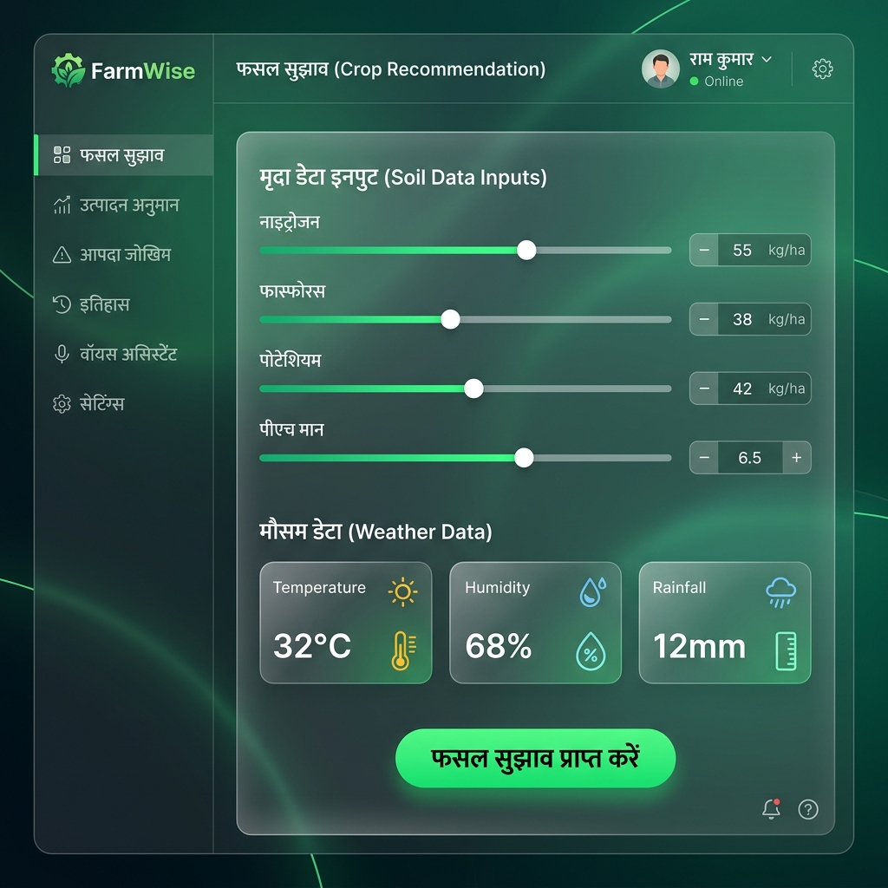
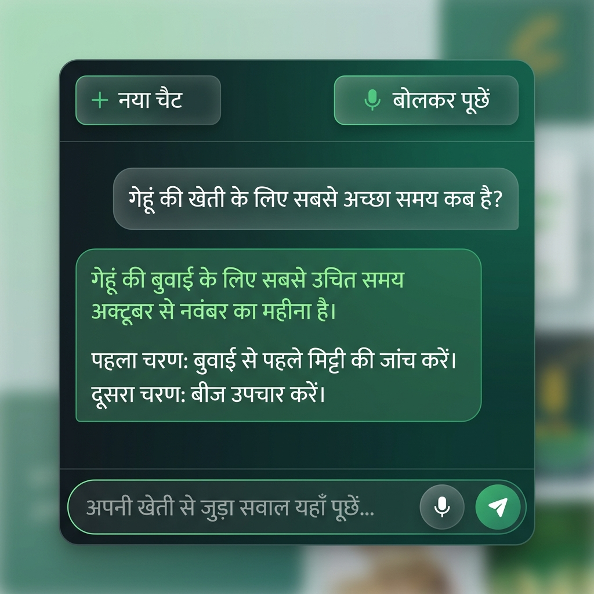

# 🌾 FarmWise — Smart Crop Advisory

A multilingual, AI-powered farming advisory Progressive Web App (PWA) built for Indian farmers. Supports **Hindi**, **English**, and **Odia**.



---

## ✨ Features

- 🌱 **Crop Recommendation** — AI-powered suggestions based on soil (N, P, K, pH) and live weather data
- 📊 **Yield Prediction** — Predict crop production using ML models (Decision Tree)
- ⚠️ **Calamity Risk** — Drought, flood, heat stress, pest, and erosion risk analysis
- 📜 **History** — Full prediction history with export to PDF
- 🎙️ **Hindi Voice Assistant** — Chat or speak in Hindi; AI answers in pure Hindi steps
- 🛰️ **Live Location** — Auto-detect GPS location for weather & soil data
- 📱 **PWA** — Install on phone, works offline for cached features
- 🔐 **Secure Login** — Phone-based login, profile saved to PostgreSQL (Supabase)
- 🌙 **Dark/Light Mode** — Theme switcher
- 🌐 **i18n** — Full translations: Hindi, English, Odia

---

## 🎙️ Voice Assistant (AI — Hindi)



Chat or speak your question in Hindi. The AI responds in pure Hindi with numbered steps.

---

## 🛠️ Tech Stack

| Layer | Technology |
|---|---|
| Frontend | React 18, Vite, TypeScript, Tailwind CSS |
| UI Components | Radix UI, shadcn-style, Lucide React |
| API | Node.js + Express (TypeScript) |
| Database | PostgreSQL via Supabase (Drizzle ORM) |
| AI / Voice | Google Gemini AI (`@google/genai`) |
| ML Models | Random Forest (Crop), Decision Tree (Yield) — Python |
| i18n | i18next, react-i18next |
| PWA | Vite PWA plugin, manifest.json |

---

## 🚀 Getting Started

### Prerequisites

- **Node.js** 18+
- **npm**
- **Python** 3.8+ (for ML model service)
- A modern browser (Chrome/Firefox) with microphone permissions for voice features

### 1. Clone & Install

```bash
git clone https://github.com/SakshiMishra-tech/FarmSmartAdvisory-.git
cd FarmSmartAdvisory-
npm install --legacy-peer-deps
```

### 2. Configure Environment

Create a `.env` file in the project root:

```env
DATABASE_URL=your_supabase_postgresql_connection_string
GEMINI_API_KEY=your_google_gemini_api_key
OPENWEATHER_API_KEY=your_openweathermap_api_key
```

> 💡 Weather falls back to regional seasonal averages if no API key is provided.

### 3. Push Database Schema

```bash
npm run db:push
```

### 4. Run the App

```bash
npm run dev
```

Open the URL printed in the terminal (usually `http://localhost:5000`).

---

## 📁 Project Structure

```
client/          React frontend (Vite + TypeScript)
  src/
    components/  UI components (crop, yield, voice, settings, etc.)
    pages/       Dashboard, Login pages
    lib/         i18n, transliteration, supabase, utils
server/          Express API server
  routes.ts      All API endpoints
  storage.ts     Database layer (Drizzle ORM)
  voice-assistant.ts  Gemini AI integration
  ml_service.py  Python ML inference service
shared/          Shared TypeScript schema (Drizzle + Zod)
docs/images/     README screenshots
```

---

## 🧰 Useful Commands

```bash
npm run dev        # Start development server
npm run build      # Build for production
npm run start      # Run production build
npm run check      # TypeScript type check
npm run db:push    # Push schema changes to database
```

---

## 📸 Adding Your Own Screenshots

To replace the placeholder images in this README with real app screenshots:

1. Take a screenshot of your running app
2. Save them as:
   - `docs/images/dashboard.png` — Dashboard / Crop Recommendation page
   - `docs/images/voice-assistant.png` — Voice Assistant chat page
3. Commit and push:
   ```bash
   git add docs/images/
   git commit -m "Add real app screenshots to README"
   git push
   ```

---

## 📜 License

MIT License — Free to use and modify.

---

> Made with ❤️ for Indian Farmers 🇮🇳
